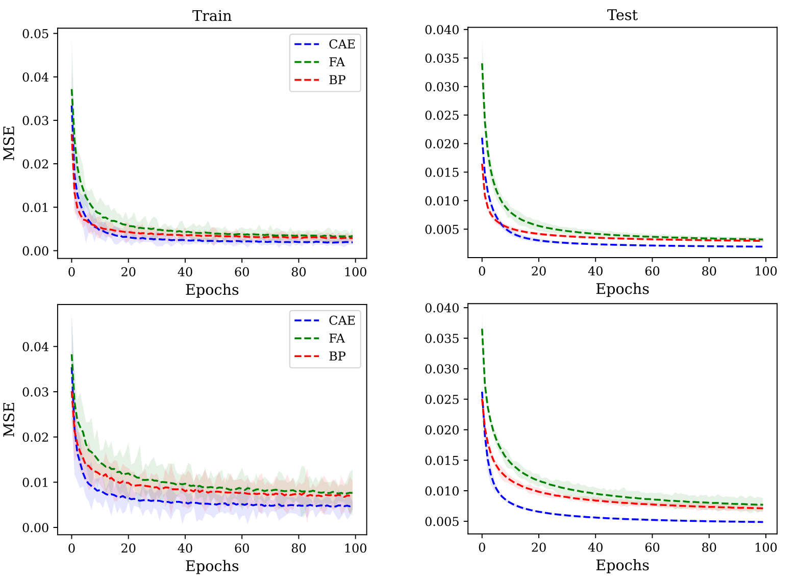
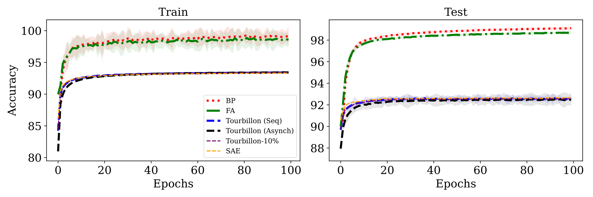
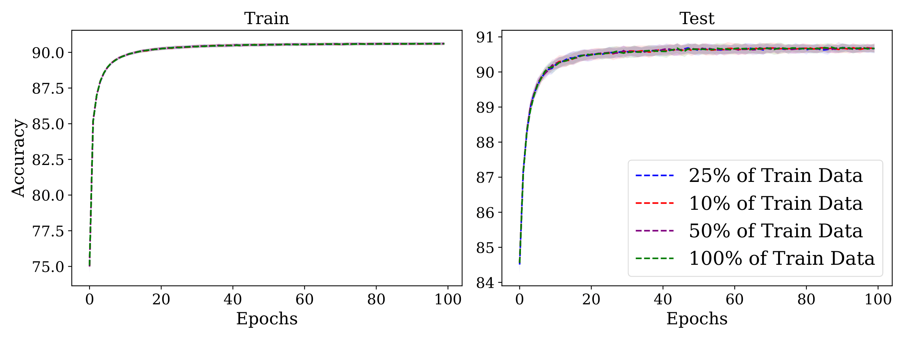
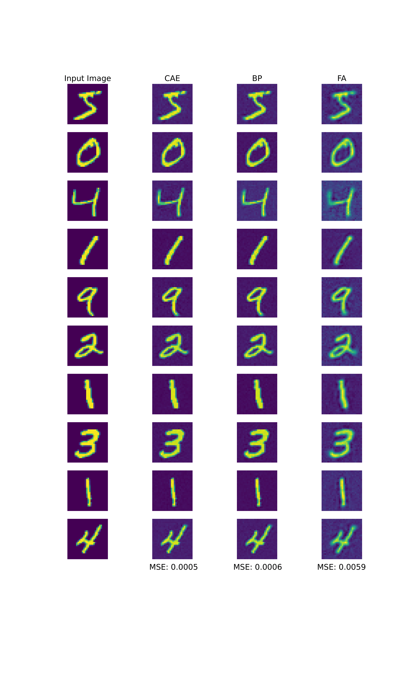
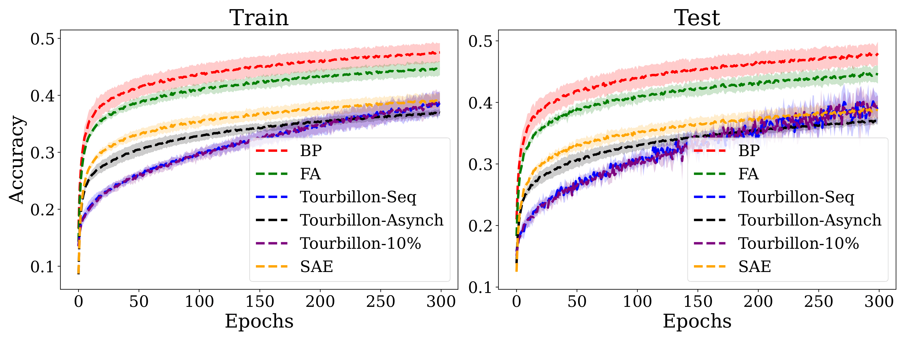

# Tourbillon

## Dependencies

requirements.txt lists the requirements to run the repo. Run the command pip install -r requirements.txt in order to install all dependencies for this repo.

## Circular Autoencoders

Contains the main files required to train single layer autoencoders using the recirculation, backpropagation, and feedback alignment methodologies. Separated by the dataset used (Mnist, Fashion Mnist, and CIFAR-10)

### Each file takes the following arguments:

(*Required*) training_type: Training type for the model (Recirculation, RBP, BP)

batchsize: Input batch size for training (default: 64)

learning_rate: Learning rate for the classifier (default: 0.001)

device: Device used to run program (default: cpu)

seed: Seed used for reproducibility (default: 101)

ncirc: Number of CAE recirculations (default: 1)

## Stacked Autoencoders

Contains the main files required to train stacked autoencoders trained either asynchronously or sequentially using recirculation. Separated by training methodology (sequential, asynchronous, backpropagation, and feedback alignment)

### Each file takes the following arguments:

batchsize: Input batch size for training (default: 64)

learning_rate: Learning rate for the classifier (default: 0.001)

device: Device used to run program (default: cpu)

seed: Seed used for reproducibility (default: 101)

### For the sequential recirculation training algorithm

ncirc: Number of CAE recirculations (default: 1)

hidden_sizes: Hidden hinge layer sizes of the stacked autoencoders (default: [256])

### For the asynchronous recirculation training algorithm

ncirc: Number of CAE recirculations (default: 1)

hidden_sizes: Hidden hinge layer sizes of the stacked autoencoders (default: [256])

num_batch_iterations: Number of batches used to asynchronously train the stack (default: 10000)

## Data

The datasets used in this project are:

[Mnist](http://yann.lecun.com/exdb/mnist/)

[FashionMnist](https://www.kaggle.com/datasets/zalando-research/fashionmnist)

[Cifar-10](https://www.cs.toronto.edu/~kriz/cifar.html)

## Figures
### Figure 3

### Figure 4

### Figure 6

### Figure A.3

## Revised Figures
### Figure 5
Revised Figure 5. from https://www.overleaf.com/project/66b013e56ed3a6386b8dd17f

